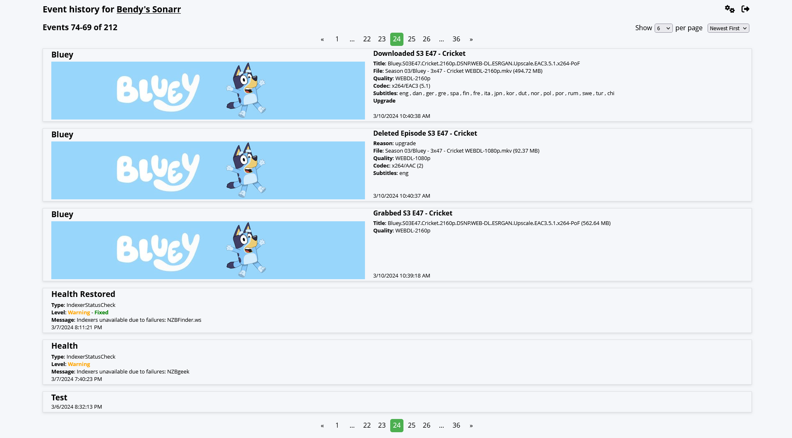
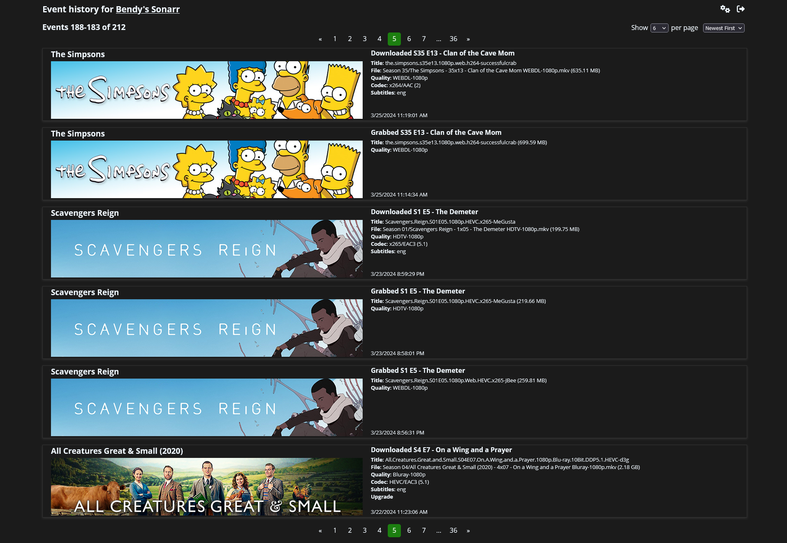
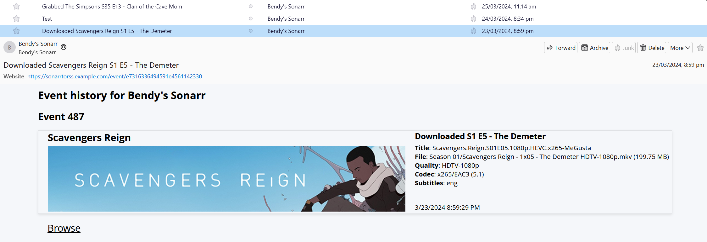

# </img> Sonarr To RSS

Sonarr To RSS is a [Sonarr](https://sonarr.tv/ "Sonarr") Webhook connection endpoint that streams
events to RSS/Atom/JSON feeds and provides a paginated website to browse historical events.

#### Light mode
[](https://raw.githubusercontent.com/gbendy/sonarrToRSS/main/img/lightMode.png)

#### Dark mode
[](https://raw.githubusercontent.com/gbendy/sonarrToRSS/main/img/darkMode.png)

#### RSS feed
[](https://raw.githubusercontent.com/gbendy/sonarrToRSS/main/img/feed.png)

## Getting Started

### Docker

Sonarr to RSS can be conveniently installed via [Docker](https://hub.docker.com/r/gbendy/sonarrtorss
"Docker").

### Unraid

Sonarr to RSS is available as an [Unraid](https://unraid.net "Unraid") Community Application. Just
search for 'Sonarr to RSS' in the `Apps` tab to install.

### From Source

Sonarr to RSS requires Node.js 20 or later and can be run directly from a repository clone.

```
git clone https://github.com/gbendy/sonarrToRSS.git
cd sonarrToRSS
npm install
npm run build
npm run start
```

Once started connect to `http://localhost:18989`, set initial configuration then configure a Sonarr
Webhook Connection to send events to `http://localhost:18989/sonarr`. RSS feed is available at
`http://localhost:18989/rss`.

## Features

### Current Features

- Simple and convenient file based persistence, no external services required.
- Minimal configuration. Set a username and password on initial load and you're good to go. All
  configuration changes can be applied in situ. No restarts!
- Content aware event rendering provides rich event specific data. Add connection information for
  your Sonarr installation to add series banner images in events.
- Light and dark themes.
- Supports domain and subfolder based reverse proxies.
  [SWAG](https://docs.linuxserver.io/general/swag "SWAG") configurations are available
  [here](https://github.com/gbendy/sonarrToRSS/tree/main/swag "Swag configuration files").
- Configurable cooldown for Health events to suppress transient issues from the feed, or purge them
  from history entirely.

## I've forgotten my password!

Cleansing with fire is the preferred solution to this problem.

Alternatively, shutdown the server. Edit `config.json` and set `"configured": false` then restart
the server. It will start in initial configuration mode, with your original configuration intact and
force you to set a new password.

## Contributing

### Development

This project exists thanks to all the people who
[contribute](https://github.com/gbendy/sonarrToRSS/graphs/contributors "Contributers").

- [Brendan Hack](https://github.com/gbendy "Brendan Hack")

To help out fork the repository, make same changes and submit a PR.

### Licenses

- [GNU GPL v3](http://www.gnu.org/licenses/gpl.html)
- Copyright 2024
